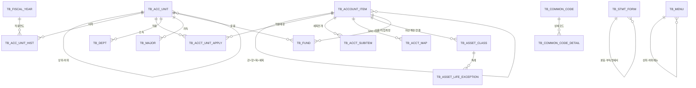

# 사학기관 재무회계 시스템 설계문서 — 기준정보(Master Data) 편

- 근거자료: 「사학기관 재무회계 규칙에 대한 특례규칙 해설서(2023.12.)」(한국사학진흥재단), 총 562p
- 근거법령: 「사립학교법」제29~31조, 「사학기관 재무·회계 규칙」, 「사학기관 재무·회계 규칙에 대한 특례규칙」(이하 특례규칙) 및 별표1~4, 별지 제1~8호 서식
- 작성범위: 시스템 전체 설계 중 **기준정보(Master Data) 도메인**의 테이블 정의서와 메뉴 설계
- 작성일: 2026-09-26

---

## 1. 시스템 개요 및 기준정보 분류 체계

### 1.1 시스템이 다뤄야 하는 회계 구조 (해설서 분석 요약)

해설서 전체(Ⅰ~Ⅴ장)를 분석한 결과, 사학기관 재무회계 시스템은 아래와 같은 법적 구조를 그대로 코드화해야 한다.

- **회계연도**: 매년 3.1 ~ 익년 2월 말일 (결산기준일 = 2월 말일, 결산서 제출 = 회계연도 종료 후 3개월 이내)
- **회계단위 계층**: 법인 ─ (법인일반업무회계 / 법인수익사업회계), 학교 ─ 교비회계(등록금회계/비등록금회계) / 부속병원회계 / 학교기업회계, 그 외 산학협력단회계(별도규칙)는 종합·합산재무제표 작성 시 통합 대상
- **재무제표 3종 + 부속명세서 + 종합/합산 재무제표**: 자금계산서, 재무상태표, 운영계산서 (특례규칙 §16~27, 별지 제3~5호 서식)
- **계정과목 코드체계**: 관(4자리 중 상위 2자리)-항(3번째 자리)-목(4번째 자리)의 4단계 숫자코드, 별표1(자금계산서)·별표2(재무상태표)·별표3(운영계산서)에 계정과목명세표로 법정화. 동일 코드가 재무제표 간에 공유되는 통합 체계(예: 5111 학부입학금은 자금계산서·운영계산서에 공통 사용)
- **부속명세서 20여종**: 별지 제1호의2~7(예산 부속서류), 별지 제4호의2~16(재무상태표 부속서류), 별지 제5호의2~4(운영계산서 부속서류)
- **고정자산 분류/내용연수(별표4)**: 건축물1(40년)/건축물2(20년)/연구기자재(5년)/기계비품(5년, 선박·항공기 12년)/차량운반구(5년)/소프트웨어(5년)/도서(5년), 감가상각방법은 정액법 단일 적용, 중고자산 특례(수정내용연수 = 기준내용연수의 50%~100%)
- **예산-결산 제출일정**: 예산서(회계연도 개시 5일 전 공시), 결산서(회계연도 종료 후 3개월 이내 이사회 확정·공시, 외부감사보고서 첨부)

이 구조 중 반복적으로 참조·검증되어야 하는 코드성 정보를 **기준정보(Master Data)** 로 분리한다.

### 1.2 기준정보 분류 체계 (6대 영역)

| 영역 | 설명 | 관련 법적 근거 |
|---|---|---|
| A. 회계기준정보 | 회계연도, 회계단위(법인/학교/등록금/비등록금 등) | 사립학교법 §29, 특례규칙 §5 |
| B. 계정과목기준정보 | 관·항·목·세목 계정과목, 계정 간 대응관계 | 특례규칙 §17, 별표1~3 |
| C. 서식/부속명세서기준정보 | 재무제표 서식, 부속명세서 서식, 제출일정 | 특례규칙 §16~27, 42, 별지 1~8호 |
| D. 자산기준정보 | 고정자산 분류, 내용연수, 감가상각방법 | 특례규칙 §34, 별표4 |
| E. 조직/거래처기준정보 | 부서, 학과, 거래처, 금융기관, 적립금(기금) | 별지 제1호의3, 4호의2~15 등 |
| F. 공통기준정보 | 공통코드, 법령/조문, 사용자권한·메뉴 | 시스템 공통 |

---

## 2. 테이블 정의서

> 표기 규칙: PK(기본키) / FK(외래키) / N(NULL 허용) / NN(NOT NULL). 코드 컬럼은 모두 `VARCHAR`.

### A. 회계기준정보

#### A-1. TB_FISCAL_YEAR (회계연도 마스터)

| 컬럼명 | 타입 | 제약 | 설명 |
|---|---|---|---|
| FY_CD | VARCHAR(4) | PK | 회계연도(예: '2026') |
| FY_START_DT | DATE | NN | 회계연도 개시일(당해 3.1) |
| FY_END_DT | DATE | NN | 회계연도 종료일(익년 2월 말일) |
| BUDGET_OPEN_DT | DATE | N | 예산서 공시기한(개시 5일전) |
| SETTLE_DUE_DT | DATE | N | 결산서 제출기한(종료후 3개월 이내) |
| FY_STATUS_CD | VARCHAR(2) | NN, FK→TB_COMMON_CODE | 회계연도 상태(예산편성중/집행중/결산중/확정/공개) |
| REMARKS | VARCHAR(500) | N | 비고 |

#### A-2. TB_ACC_UNIT (회계단위 마스터) — 자기참조 계층구조

| 컬럼명 | 타입 | 제약 | 설명 |
|---|---|---|---|
| ACC_UNIT_CD | VARCHAR(10) | PK | 회계단위코드(예: CORP, CORP_GEN, CORP_PROFIT, SCHOOL, TUITION, NONTUITION, HOSPITAL, ENT, IUCC) |
| ACC_UNIT_NM | VARCHAR(100) | NN | 회계단위명(법인/법인일반업무회계/법인수익사업회계/학교/등록금회계/비등록금회계/부속병원회계/학교기업회계/산학협력단회계) |
| PARENT_ACC_UNIT_CD | VARCHAR(10) | FK→자기참조, N | 상위 회계단위(예: 등록금회계의 상위=교비회계, 교비회계의 상위=학교) |
| ACC_UNIT_LEVEL | NUMBER(1) | NN | 1=법인/학교 대분류, 2=일반업무·수익사업 / 교비·부속병원·학교기업, 3=등록금·비등록금 |
| RULE_TYPE_CD | VARCHAR(2) | NN, FK→TB_COMMON_CODE | 적용회계규칙(특례규칙/의료기관회계기준규칙/산학협력단회계처리규칙/기업회계기준) |
| USE_YN | CHAR(1) | NN | 사용여부 |
| SORT_NO | NUMBER(3) | N | 정렬순서 |

#### A-3. TB_ACC_UNIT_HIST (회계단위 변경 이력)

| 컬럼명 | 타입 | 제약 | 설명 |
|---|---|---|---|
| ACC_UNIT_HIST_SEQ | NUMBER | PK | 이력일련번호 |
| ACC_UNIT_CD | VARCHAR(10) | FK→TB_ACC_UNIT | 회계단위코드 |
| CHG_TYPE_CD | VARCHAR(2) | NN | 변경유형(신설/폐지/명칭변경/통폐합) |
| EFF_FY_CD | VARCHAR(4) | FK→TB_FISCAL_YEAR | 적용 회계연도 |
| CHG_DESC | VARCHAR(500) | N | 변경사유 |

---

### B. 계정과목기준정보

#### B-1. TB_ACCOUNT_ITEM (계정과목 마스터) — 관/항/목 통합, 자기참조 계층구조

특례규칙 별표1(자금계산서)·별표2(재무상태표)·별표3(운영계산서)은 계정과목 코드를 공유하므로(예: 5111 학부입학금이 자금계산서·운영계산서에 공통 등장), 3개 별표를 하나의 통합 마스터로 설계하고 재무제표별 사용여부를 플래그로 분리한다.

| 컬럼명 | 타입 | 제약 | 설명 |
|---|---|---|---|
| ACCT_CD | VARCHAR(6) | PK | 계정과목코드(4자리 숫자, 세목 확장 시 6자리) |
| ACCT_NM | VARCHAR(100) | NN | 계정과목명 |
| PARENT_ACCT_CD | VARCHAR(6) | FK→자기참조, N | 상위 계정과목코드(목→항→관) |
| ACCT_LEVEL | NUMBER(1) | NN | 1=관, 2=항, 3=목, 4=세목 |
| STMT_GRP_CD | VARCHAR(2) | NN, FK→TB_COMMON_CODE | 재무제표 그룹(1=자산, 2=부채및기본금, 4=비용/지출, 5=수익/수입) — 코드 첫자리와 일치 |
| CASH_STMT_USE_YN | CHAR(1) | NN | 자금계산서(별표1) 사용여부 |
| BS_USE_YN | CHAR(1) | NN | 재무상태표(별표2) 사용여부 |
| IS_USE_YN | CHAR(1) | NN | 운영계산서(별표3) 사용여부 |
| CORP_USE_YN | CHAR(1) | NN | 법인회계 적용여부(별표 "적용회계"란 ○/×) |
| SCHOOL_USE_YN | CHAR(1) | NN | 학교회계 적용여부(별표 "적용회계"란 ○/×) |
| BUDGET_USE_YN | CHAR(1) | NN | 예산편성 대상 여부(예산에 없는 결산전용 과목 구분, 예: 감가상각비) |
| DESCRIPTION | VARCHAR(1000) | N | 계정 해설(별표의 "해설"란 원문) |
| LEGAL_ARTICLE | VARCHAR(50) | N | 근거조문(예: '특례규칙 §17, 별표2') |
| EFF_START_FY | VARCHAR(4) | FK→TB_FISCAL_YEAR, N | 계정 신설/개정 적용 시작 회계연도 |
| EFF_END_FY | VARCHAR(4) | FK→TB_FISCAL_YEAR, N | 계정 폐지 회계연도(폐지 코드 이력관리, 예: 1251/1261/3151/3161 결번) |
| USE_YN | CHAR(1) | NN | 사용여부 |
| SORT_NO | NUMBER(4) | N | 정렬순서 |

> 비고: 코드 결번(1251, 1261, 3151, 3161 등 대응관계 유지 목적 미사용 코드)은 `USE_YN='N'`, `DESCRIPTION`에 결번 사유 기록으로 관리한다.

#### B-2. TB_ACCT_UNIT_APPLY (계정과목-회계단위 적용 매핑) — 법정 2단계(법인/학교) 이상의 세분화 운영 대응

해설서상 등록금회계/비등록금회계 간 상호 대응계정(예: 5218 등록금회계전입금, 3173 비등록금회계) 및 부속병원·산학협력단 확장 운용을 지원하기 위한 시스템 확장 테이블(법정 별표에는 없으나 실무운영상 필수).

| 컬럼명 | 타입 | 제약 | 설명 |
|---|---|---|---|
| ACCT_CD | VARCHAR(6) | PK, FK→TB_ACCOUNT_ITEM | 계정과목코드 |
| ACC_UNIT_CD | VARCHAR(10) | PK, FK→TB_ACC_UNIT | 회계단위코드 |
| USE_YN | CHAR(1) | NN | 해당 회계단위에서 사용가능 여부 |
| BUDGET_YN | CHAR(1) | NN | 해당 회계단위 예산편성 대상 여부(고정예산/변동예산 구분과 결합) |

#### B-3. TB_ACCT_MAP (계정과목 대응관계 마스터)

전출/전입, 기금/적립금 인출-적립 등 상호 대응되는 계정 쌍을 관리(예: 4516 교내전출금 ↔ 5216 교내전입금, 1250 원금보존기금인출 ↔ 3150 원금보존적립금, 4235 교비회계 ↔ 3173 비등록금회계).

| 컬럼명 | 타입 | 제약 | 설명 |
|---|---|---|---|
| MAP_SEQ | NUMBER | PK | 매핑일련번호 |
| SRC_ACCT_CD | VARCHAR(6) | FK→TB_ACCOUNT_ITEM | 원천 계정과목 |
| DST_ACCT_CD | VARCHAR(6) | FK→TB_ACCOUNT_ITEM | 대응 계정과목 |
| MAP_TYPE_CD | VARCHAR(2) | FK→TB_COMMON_CODE | 대응유형(전출입/기금적립인출/내부거래제거/재평가대체 등) |
| ELIM_YN | CHAR(1) | NN | 종합·합산재무제표 작성시 내부거래 제거대상 여부 |
| REMARKS | VARCHAR(500) | N | 비고(해설서 "n조목과 대응" 원문 인용) |

#### B-4. TB_ACCT_SUBITEM (세목 마스터) — 목(目) 하위, 기관 자율 관리 레벨

법령상 세목은 명칭만 규정(예: 5218 세목=건축적립금적립액/차입원리금상환액, 5231 세목=국가장학금지원금/기타지원금)하고 코드는 기관이 자율 부여하므로 별도 테이블로 분리한다.

| 컬럼명 | 타입 | 제약 | 설명 |
|---|---|---|---|
| SUBITEM_CD | VARCHAR(8) | PK | 세목코드(기관부여, ACCT_CD + 일련번호) |
| ACCT_CD | VARCHAR(6) | FK→TB_ACCOUNT_ITEM, NN | 상위 목(目) 코드 |
| SUBITEM_NM | VARCHAR(100) | NN | 세목명 |
| LEGAL_MANDATORY_YN | CHAR(1) | NN | 해설서상 세목구분이 명시적으로 요구되는 항목인지 여부 |
| USE_YN | CHAR(1) | NN | 사용여부 |
| SORT_NO | NUMBER(3) | N | 정렬순서 |

---

### C. 서식/부속명세서 기준정보

#### C-1. TB_STMT_FORM (재무제표·부속명세서 서식 마스터)

| 컬럼명 | 타입 | 제약 | 설명 |
|---|---|---|---|
| FORM_CD | VARCHAR(20) | PK | 서식코드(예: 'BYLJ-01', 'BYLJ-04-10' → 별지 제1호서식, 별지 제4호의10서식) |
| FORM_NO_LABEL | VARCHAR(50) | NN | 법정 서식 표시명(예: '별지 제4호의10서식') |
| FORM_NM | VARCHAR(200) | NN | 서식명(예: '미지급금명세서') |
| FORM_CATEGORY_CD | VARCHAR(2) | NN, FK→TB_COMMON_CODE | 구분(예산서/추경예산서/결산서-재무제표/결산서-부속명세서/종합재무제표/합산재무제표) |
| STMT_GRP_CD | VARCHAR(2) | N, FK→TB_COMMON_CODE | 소속 재무제표(자금계산서/재무상태표/운영계산서/해당없음) |
| PARENT_FORM_CD | VARCHAR(20) | FK→자기참조, N | 상위서식(부속명세서의 경우 소속 본표) |
| SUBMIT_TIMING_CD | VARCHAR(2) | NN, FK→TB_COMMON_CODE | 제출시점(예산편성시/추경시/결산시) |
| MANDATORY_YN | CHAR(1) | NN | 필수제출 여부 |
| LEGAL_ARTICLE | VARCHAR(100) | N | 근거조문 |
| USE_YN | CHAR(1) | NN | 사용여부 |
| SORT_NO | NUMBER(4) | N | 정렬순서 |

> 대표 데이터 예시(초기 적재용): 별지1호(자금예산서), 별지1호의2(전기말추정미수금명세서), 별지1호의3(전기말추정차입금명세서/학년별·학과별학생수명세서), 별지1호의5(등록금명세서), 별지1호의6(인건비명세서), 별지1호의7(적립금운용계획서), 별지2호(추가경정자금예산서), 별지3호(자금계산서), 별지4호(재무상태표), 별지4호의2~16(현금및예금/수표출납/선급금/가지급금/선급법인세/받을어음/투자와기타자산/투자유가증권/적립기금유가증권투자/적립기금특수관계법인유가증권투자/유형고정자산/무형고정자산/단기(장기)차입금/미지급금/가수금/지급어음/어음출납/차관/학교채/적립금/미사용차기이월자금 명세서), 별지5호(운영계산서), 별지5호의2~4(전입금/예비비사용액/고정자산감가상각비 명세서), 별지6호(종합자금계산서/재무상태표/운영계산서), 별지7호(합산자금계산서/재무상태표/운영계산서), 별지8호(합계잔액시산표)

#### C-2. TB_SUBMIT_SCHEDULE (예산·결산 제출일정 마스터)

| 컬럼명 | 타입 | 제약 | 설명 |
|---|---|---|---|
| SCHEDULE_CD | VARCHAR(10) | PK | 일정코드 |
| SCHEDULE_NM | VARCHAR(200) | NN | 일정명(예: '학교장→이사장 결산보고서 제출', '이사회 결산 심의·확정', '결산서 교육부 제출·공개') |
| PROCESS_TYPE_CD | VARCHAR(2) | NN, FK→TB_COMMON_CODE | 구분(예산/결산) |
| RESPONSIBLE_ROLE_CD | VARCHAR(2) | N, FK→TB_COMMON_CODE | 책임주체(이사장/학교의장/이사회/대학평의원회/등록금심의위원회) |
| DUE_RULE_CD | VARCHAR(2) | NN, FK→TB_COMMON_CODE | 기한산정기준(회계연도개시전 5일/회계연도종료후 3개월 등) |
| LEGAL_ARTICLE | VARCHAR(100) | N | 근거조문(특례규칙 §42 등) |
| SORT_NO | NUMBER(3) | N | 처리순서 |

---

### D. 자산기준정보

#### D-1. TB_ASSET_CLASS (고정자산 분류/내용연수 마스터 — 별표4)

| 컬럼명 | 타입 | 제약 | 설명 |
|---|---|---|---|
| ASSET_CLASS_CD | VARCHAR(10) | PK | 자산분류코드 |
| ASSET_CLASS_NM | VARCHAR(100) | NN | 분류명(건축물1/건축물2/연구기자재/기계비품/차량운반구/소프트웨어/도서 등) |
| LINK_ACCT_CD | VARCHAR(6) | FK→TB_ACCOUNT_ITEM, N | 연결 계정과목(1312 건물, 1314 기계기구 등) |
| USEFUL_LIFE_YEARS | NUMBER(3) | NN | 법정 내용연수(년) |
| DEPR_METHOD_CD | VARCHAR(2) | NN, FK→TB_COMMON_CODE | 감가상각방법(정액법 고정) |
| STRUCTURE_DESC | VARCHAR(500) | N | 구조/자산 상세 기준(별표4 원문, 예: '철골·철근콘크리트조 등') |
| LEGAL_ARTICLE | VARCHAR(50) | N | 근거(특례규칙 §34③, 별표4) |
| USE_YN | CHAR(1) | NN | 사용여부 |

#### D-2. TB_ASSET_LIFE_EXCEPTION (내용연수 특례 마스터 — 중고자산/전자구독물 등)

| 컬럼명 | 타입 | 제약 | 설명 |
|---|---|---|---|
| EXCEPTION_CD | VARCHAR(10) | PK | 특례코드 |
| ASSET_CLASS_CD | VARCHAR(10) | FK→TB_ASSET_CLASS | 대상 자산분류 |
| EXCEPTION_TYPE_CD | VARCHAR(2) | NN, FK→TB_COMMON_CODE | 유형(중고자산/전자구독물(계약기간상각)) |
| MIN_LIFE_RATE | NUMBER(3,0) | N | 최소 적용비율(중고자산: 기준내용연수의 50%) |
| MAX_LIFE_RATE | NUMBER(3,0) | N | 최대 적용비율(100%) |
| ROUNDING_RULE | VARCHAR(200) | N | 단수처리(6월 이하 절사, 6월 초과 절상) |
| LEGAL_ARTICLE | VARCHAR(100) | N | 근거(법인세법시행령 §29-2 준용 등) |

#### D-3. TB_CAPEX_CLASSIFY_GUIDE (자본적지출/수익적지출 판정기준 마스터 — 참고정보성 코드)

| 컬럼명 | 타입 | 제약 | 설명 |
|---|---|---|---|
| GUIDE_CD | VARCHAR(10) | PK | 판정기준코드 |
| EXPEND_TYPE_CD | VARCHAR(2) | NN, FK→TB_COMMON_CODE | 자본적지출/수익적지출 |
| EXAMPLE_DESC | VARCHAR(500) | NN | 사례(도장/부품교체=수익적, 엘리베이터 설치=자본적 등) |
| LEGAL_ARTICLE | VARCHAR(100) | N | 근거(법인세법시행령 §31②, 시행규칙 §17) |

---

### E. 조직/거래처 기준정보

#### E-1. TB_DEPT (부서 마스터)

| 컬럼명 | 타입 | 제약 | 설명 |
|---|---|---|---|
| DEPT_CD | VARCHAR(10) | PK | 부서코드 |
| DEPT_NM | VARCHAR(100) | NN | 부서명 |
| PARENT_DEPT_CD | VARCHAR(10) | FK→자기참조, N | 상위부서 |
| ACC_UNIT_CD | VARCHAR(10) | FK→TB_ACC_UNIT, NN | 소속 회계단위(예산집행 귀속) |
| DEPT_TYPE_CD | VARCHAR(2) | NN, FK→TB_COMMON_CODE | 예산부서/학과/행정부서 구분 |
| USE_YN | CHAR(1) | NN | 사용여부 |

#### E-2. TB_MAJOR (학과 마스터) — 학년별·학과별 학생수명세서(별지1호의3) 대응

| 컬럼명 | 타입 | 제약 | 설명 |
|---|---|---|---|
| MAJOR_CD | VARCHAR(10) | PK | 학과코드 |
| MAJOR_NM | VARCHAR(100) | NN | 학과명 |
| COLLEGE_CD | VARCHAR(10) | FK→TB_DEPT, N | 소속 단과대학(부서마스터 참조) |
| SCHOOL_LEVEL_CD | VARCHAR(2) | NN, FK→TB_COMMON_CODE | 과정구분(학부/대학원/원격대학 등) |
| ACC_UNIT_CD | VARCHAR(10) | FK→TB_ACC_UNIT, NN | 등록금 귀속 회계단위(등록금회계) |
| USE_YN | CHAR(1) | NN | 사용여부 |

#### E-3. TB_COUNTERPARTY (거래처/금융기관 마스터)

현금및예금·수표출납·받을(지급)어음·차입금·차관·학교채·투자유가증권 명세서 등에서 공통 참조.

| 컬럼명 | 타입 | 제약 | 설명 |
|---|---|---|---|
| CP_CD | VARCHAR(15) | PK | 거래처코드 |
| CP_NM | VARCHAR(200) | NN | 거래처명(금융기관명/법인명 등) |
| CP_TYPE_CD | VARCHAR(2) | NN, FK→TB_COMMON_CODE | 유형(금융기관/특수관계법인/일반거래처/발행기관 등) |
| BIZ_REG_NO | VARCHAR(20) | N | 사업자(고유)번호 |
| SPECIAL_RELATION_YN | CHAR(1) | NN | 특수관계법인 여부(적립기금 특수관계법인 유가증권 명세서용) |
| USE_YN | CHAR(1) | NN | 사용여부 |

#### E-4. TB_FUND (적립금/기금 마스터)

원금보존기금·임의기금 및 대응 적립금 계정(1250/3150, 1260/3160 계열)을 관리.

| 컬럼명 | 타입 | 제약 | 설명 |
|---|---|---|---|
| FUND_CD | VARCHAR(10) | PK | 기금코드 |
| FUND_NM | VARCHAR(100) | NN | 기금명(원금보존연구기금/임의건축기금 등) |
| FUND_TYPE_CD | VARCHAR(2) | NN, FK→TB_COMMON_CODE | 원금보존/임의 구분 |
| PURPOSE_CD | VARCHAR(2) | NN, FK→TB_COMMON_CODE | 목적(연구/건축/장학/퇴직/특정목적) |
| WITHDRAW_ACCT_CD | VARCHAR(6) | FK→TB_ACCOUNT_ITEM | 인출시 계정(1252~1266 등) |
| RESERVE_ACCT_CD | VARCHAR(6) | FK→TB_ACCOUNT_ITEM | 적립시 계정(3152~3166 등) |
| ACC_UNIT_CD | VARCHAR(10) | FK→TB_ACC_UNIT | 운용 회계단위 |
| USE_YN | CHAR(1) | NN | 사용여부 |

---

### F. 공통기준정보

#### F-1. TB_COMMON_CODE / TB_COMMON_CODE_DETAIL (공통코드 마스터)

| 컬럼명 | 타입 | 제약 | 설명 |
|---|---|---|---|
| GROUP_CD | VARCHAR(10) | PK | 코드그룹(예: STMT_GRP, ACC_RULE_TYPE, MAP_TYPE, DEPR_METHOD, EXPEND_TYPE) |
| GROUP_NM | VARCHAR(100) | NN | 그룹명 |

| 컬럼명 | 타입 | 제약 | 설명 |
|---|---|---|---|
| GROUP_CD | VARCHAR(10) | PK, FK→TB_COMMON_CODE | 코드그룹 |
| DETAIL_CD | VARCHAR(10) | PK | 상세코드 |
| DETAIL_NM | VARCHAR(100) | NN | 상세코드명 |
| SORT_NO | NUMBER(3) | N | 정렬순서 |
| USE_YN | CHAR(1) | NN | 사용여부 |

#### F-2. TB_LEGAL_BASIS (법령/조문 마스터) — 계정과목·서식·자산분류 등의 근거 추적

| 컬럼명 | 타입 | 제약 | 설명 |
|---|---|---|---|
| LEGAL_CD | VARCHAR(10) | PK | 법령코드 |
| LEGAL_NM | VARCHAR(100) | NN | 법령명(사립학교법/사학기관 재무·회계 규칙/특례규칙/법인세법시행령 등) |
| ARTICLE_NO | VARCHAR(20) | N | 조문번호 |
| EFF_DATE | DATE | N | 시행/개정일 |
| CONTENT_SUMMARY | VARCHAR(1000) | N | 요지 |

#### F-3. TB_MENU (메뉴 마스터) — 5장에서 상세 정의

---

## 3. 테이블 관계도 (ERD 요약)



---

## 4. 메뉴 정보 설계

### 4.1 메뉴 트리 (기준정보 관리 모듈)

```
90. 기준정보관리
├── 91. 회계기준정보
│   ├── 9101. 회계연도관리                (TB_FISCAL_YEAR)
│   ├── 9102. 회계단위관리                (TB_ACC_UNIT / TB_ACC_UNIT_HIST)
│   └── 9103. 회계단위-부서 매핑관리       (TB_DEPT)
├── 92. 계정과목기준정보
│   ├── 9201. 계정과목관리(관·항·목)       (TB_ACCOUNT_ITEM)
│   ├── 9202. 계정과목-회계단위 적용관리   (TB_ACCT_UNIT_APPLY)
│   ├── 9203. 계정과목 대응관계관리        (TB_ACCT_MAP)
│   ├── 9204. 세목관리                    (TB_ACCT_SUBITEM)
│   └── 9205. 계정과목 개정이력조회        (TB_ACCOUNT_ITEM 이력)
├── 93. 서식/부속명세서기준정보
│   ├── 9301. 재무제표서식관리             (TB_STMT_FORM)
│   ├── 9302. 부속명세서서식관리           (TB_STMT_FORM, PARENT_FORM_CD)
│   └── 9303. 예산·결산 제출일정관리       (TB_SUBMIT_SCHEDULE)
├── 94. 자산기준정보
│   ├── 9401. 고정자산분류(내용연수)관리   (TB_ASSET_CLASS)
│   ├── 9402. 내용연수특례관리(중고자산 등) (TB_ASSET_LIFE_EXCEPTION)
│   └── 9403. 자본적지출판정기준조회        (TB_CAPEX_CLASSIFY_GUIDE)
├── 95. 조직/거래처기준정보
│   ├── 9501. 부서관리                    (TB_DEPT)
│   ├── 9502. 학과관리                    (TB_MAJOR)
│   ├── 9503. 거래처(금융기관)관리         (TB_COUNTERPARTY)
│   └── 9504. 적립금(기금)관리             (TB_FUND)
└── 96. 공통기준정보
    ├── 9601. 공통코드관리                 (TB_COMMON_CODE / DETAIL)
    ├── 9602. 법령/조문관리                (TB_LEGAL_BASIS)
    └── 9603. 메뉴/권한관리                (TB_MENU, 권한테이블)
```

### 4.2 메뉴 정의서

| 메뉴ID | 메뉴명 | 상위메뉴ID | 레벨 | 관련 테이블 | 주요 기능 |
|---|---|---|---|---|---|
| 90 | 기준정보관리 | - | 1 | - | 대분류(모듈 진입점) |
| 91 | 회계기준정보 | 90 | 2 | - | 중분류 |
| 9101 | 회계연도관리 | 91 | 3 | TB_FISCAL_YEAR | 회계연도 등록/조회, 예산공시·결산제출 기한 자동계산, 연도별 상태(편성중/집행중/결산중/확정) 전환 |
| 9102 | 회계단위관리 | 91 | 3 | TB_ACC_UNIT, TB_ACC_UNIT_HIST | 법인/학교/등록금/비등록금/부속병원/학교기업/산학협력단 트리 조회·등록, 적용회계규칙 지정, 신설·폐지 이력관리 |
| 9103 | 회계단위-부서 매핑관리 | 91 | 3 | TB_DEPT | 예산부서를 회계단위에 배정 |
| 92 | 계정과목기준정보 | 90 | 2 | - | 중분류 |
| 9201 | 계정과목관리 | 92 | 3 | TB_ACCOUNT_ITEM | 관/항/목 트리 등록·수정, 별표1~3 재무제표 사용여부·적용회계(법인/학교) 플래그 설정, 해설·근거조문 입력, 엑셀 일괄등록(별표 원문 적재) |
| 9202 | 계정과목-회계단위 적용관리 | 92 | 3 | TB_ACCT_UNIT_APPLY | 등록금/비등록금/부속병원 등 세부 회계단위별 사용가능 계정 및 예산편성대상 여부 설정 |
| 9203 | 계정과목 대응관계관리 | 92 | 3 | TB_ACCT_MAP | 전출입·기금인출적립·내부거래제거 대응쌍 등록, 종합/합산재무제표 작성시 자동 상계 처리 기준 제공 |
| 9204 | 세목관리 | 92 | 3 | TB_ACCT_SUBITEM | 목(目) 하위 세목 코드/명 등록(예: 5218 세목, 5231 세목) |
| 9205 | 계정과목 개정이력조회 | 92 | 3 | TB_ACCOUNT_ITEM | 연도별 신설·폐지·결번 계정 이력 조회(감사·비교연도 재무제표 대응) |
| 93 | 서식/부속명세서기준정보 | 90 | 2 | - | 중분류 |
| 9301 | 재무제표서식관리 | 93 | 3 | TB_STMT_FORM | 별지1~8호 서식 마스터 등록, 서식별 첨부항목/필수여부 관리 |
| 9302 | 부속명세서서식관리 | 93 | 3 | TB_STMT_FORM | 부속명세서 20종 서식-본표 연결관리, 결산/예산 부속서류 구분 |
| 9303 | 제출일정관리 | 93 | 3 | TB_SUBMIT_SCHEDULE | 예산(개시 5일전 공시)·결산(종료후 3개월 이내 제출) 등 법정기한 마스터화, 회계연도별 자동 일정 생성 |
| 94 | 자산기준정보 | 90 | 2 | - | 중분류 |
| 9401 | 고정자산분류관리 | 94 | 3 | TB_ASSET_CLASS | 자산분류/내용연수/정액법 상각방법 등록, 계정과목(1311~1321) 연결 |
| 9402 | 내용연수특례관리 | 94 | 3 | TB_ASSET_LIFE_EXCEPTION | 중고자산 수정내용연수(50%~100%) 규칙, 전자구독물 계약기간 상각규칙 등록 |
| 9403 | 자본적지출판정기준조회 | 94 | 3 | TB_CAPEX_CLASSIFY_GUIDE | 자본적/수익적 지출 판정 사례 조회(전표입력시 참고정보 제공) |
| 95 | 조직/거래처기준정보 | 90 | 2 | - | 중분류 |
| 9501 | 부서관리 | 95 | 3 | TB_DEPT | 부서 트리 등록, 회계단위 배정 |
| 9502 | 학과관리 | 95 | 3 | TB_MAJOR | 학과 등록, 등록금회계 배정(학생수명세서 연동) |
| 9503 | 거래처관리 | 95 | 3 | TB_COUNTERPARTY | 금융기관/특수관계법인/일반거래처 등록, 명세서 자동생성 연동 |
| 9504 | 적립금(기금)관리 | 95 | 3 | TB_FUND | 기금 등록, 인출/적립 대응계정 설정 |
| 96 | 공통기준정보 | 90 | 2 | - | 중분류 |
| 9601 | 공통코드관리 | 96 | 3 | TB_COMMON_CODE(_DETAIL) | 시스템 전역 코드그룹/상세코드 등록 |
| 9602 | 법령/조문관리 | 96 | 3 | TB_LEGAL_BASIS | 근거법령/조문 등록, 계정과목·서식·자산분류의 근거조문 링크 |
| 9603 | 메뉴/권한관리 | 96 | 3 | TB_MENU | 메뉴 트리 관리, 역할별 메뉴접근권한 설정 |

### 4.3 화면 공통 규칙

- 트리형 기준정보(회계단위, 계정과목, 부서, 메뉴)는 좌측 트리 + 우측 상세폼의 공통 레이아웃 사용
- 계정과목관리(9201) 화면은 별표1/2/3 탭 전환 방식으로 자금계산서·재무상태표·운영계산서 관점을 전환 조회할 수 있도록 구성(단일 마스터, 다중 뷰)
- 모든 기준정보 변경은 회계연도(FY_CD) 기준 이력관리를 원칙으로 하며, 확정된 회계연도의 기준정보는 수정 불가(조회 전용) 처리

---

## 5. 후속 설계 시 고려사항 (다음 단계)

- 본 문서는 **기준정보** 범위만 다룸. 전표(분개), 예산편성/집행, 결산마감, 부속명세서 자동산출 등 **트랜잭션 테이블**은 별도 설계 필요
- 계정과목 3,000여 개 전체 코드 데이터(별표1~3 전문)는 부록의 명세표 원문을 엑셀화하여 TB_ACCOUNT_ITEM 초기 적재 스크립트로 사용 권장
- 부속명세서 20종 각각의 상세 컬럼(서식별 개별 항목)은 트랜잭션/리포트 설계 단계에서 별도 정의 필요
